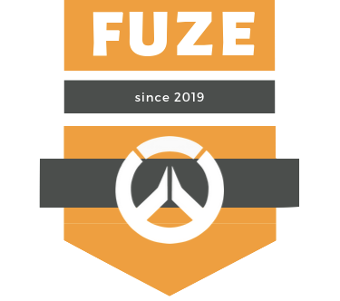
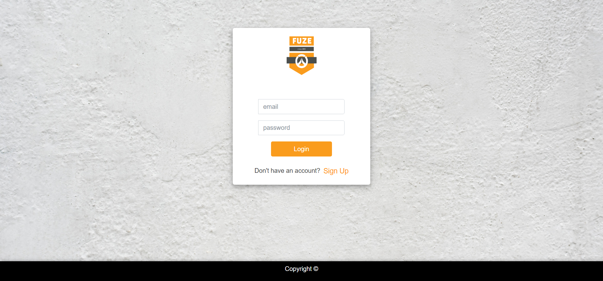

# Team Fuze Overwatch Teambuilder

[Link to deployed project](https://fuzeteam.herokuapp.com/signin)

## About
The application is for a user to find a team for Overwatch on what criteria a user is looking for.
The goal is to join or create the best team based on roles and skills.

### Instructions on how to use the application

1. ***A user will be instructed to sign in, if a user doesn't have a log in they can created a account by clicking the sign up button.***

2. ***Once logged in a user will be redirected to the team list page***

3. ***On the team list page a user can do the following:***
    1. **Create a team**
        1. A team can be created by entering a team name and a description
        2. Then clicking submit
        3. The team will be added to the List of Teams
    2. Look at a created team already by clicking it and a user will be sent to the team lobby page

4. ***On the team lobby page a user can do the following:***
    1. **Join a team by clicking join a team button**
        1. Once a user joins a team they will be inserted into a slot on the team where their battle-tag will be shown
            1. Users then can invite each other on Overwatch using their battletag

<!-- PROJECT LOGO -->
<br />
<p align="center">
  <a>
    
  </a>
</p>


<!-- TABLE OF CONTENTS -->
## Table of Contents

* [About the Project](#about-the-project)
  * [Built With](#built-with)
* [Getting Started](#getting-started)
  * [Prerequisites](#prerequisites)
  * [Installation](#installation)
* [Usage](#usage)
* [Roadmap](#roadmap)
* [Contributing](#contributing)
* [License](#license)
* [Contact](#contact)
* [Acknowledgements](#acknowledgements)


<!-- ABOUT THE PROJECT -->
## About The Project


Fuze is a web-application for a user to find a team for Overwatch on what criteria a user is looking for.
A player can use 

### Built With
* [Bootstrap](https://getbootstrap.com)
* [Javascript](https://www.javascript.com/)
* [Passport](http://www.passportjs.org/)
* [Handlebars](https://handlebarsjs.com/)
* [Express](https://expressjs.com/)
* [Node](https://nodejs.org/en/)
* [Overwatch API](https://ow-api.com)

<!-- GETTING STARTED -->
## Getting Started

This is an example of how you may give instructions on setting up your project locally.
To get a local copy up and running follow these simple example steps.

### Prerequisites

This is an example of how to list things you need to use the software and how to install them.
* npm
```sh
npm install npm@latest -g
```

### Installation

1. Get a free API Key at [https://example.com](https://example.com)
2. Clone the repo
```sh
git clone https://github.com/your_username_/Project-Name.git
```
3. Install NPM packages
```sh
npm install
```
4. Enter your API in `config.js`
```JS
const API_KEY = 'ENTER YOUR API';
```


<!-- USAGE EXAMPLES -->
## Usage

Use this space to show useful examples of how a project can be used. Additional screenshots, code examples and demos work well in this space. You may also link to more resources.

_For more examples, please refer to the [Documentation](https://example.com)_

<!-- CONTRIBUTING -->
## Contributing

Contributions are what make the open source community such an amazing place to be learn, inspire, and create. Any contributions you make are **greatly appreciated**.

1. Fork the Project
2. Create your Feature Branch (`git checkout -b feature/AmazingFeature`)
3. Commit your Changes (`git commit -m 'Add some AmazingFeature'`)
4. Push to the Branch (`git push origin feature/AmazingFeature`)
5. Open a Pull Request

<!-- CONTACT -->
## Contact

Your Name - [@your_twitter](https://twitter.com/your_username) - email@example.com

Project Link: [https://github.com/your_username/repo_name](https://github.com/your_username/repo_name)


